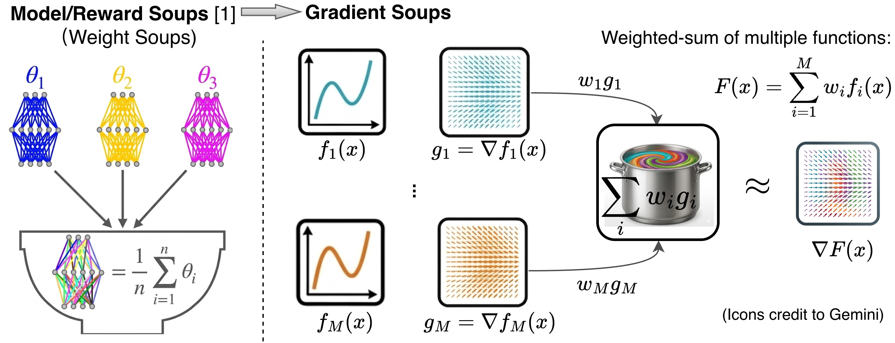

<<<<<<< HEAD
# Sample-Reward-Soups-ICLR26
Official code for "Sample Reward Soups: Query-efficient Multi-Reward Guidance for Text-to-Image Diffusion Models (ICLR 2026) "
=======
# Sample Reward Soups (SRSoup)

Official implementation of the paper:  
**“Sample Reward Soups: Query-efficient Multi-Reward Guidance for Text-to-Image Diffusion Models” (ICLR 2026)**  
👉 https://openreview.net/forum?id=MNVxrgRcJV

<p align="center">
  
</p>

---

## 🔧 Environment Setup

```bash
conda env create -f env.yml
conda activate srsoup_env
# Install CLIP
pip install git+https://github.com/openai/CLIP.git
```

Need to download HPSv2 from:
https://huggingface.co/xswu/HPSv2/blob/697403c78157020a1ae59d23f111aa58ced35b0a/HPS_v2_compressed.pt

---

## 🐾 Experiment: Animal (Aesthetic & Compress)

### Dataset
- **Training set**: 45 animal prompts  
  - `config.prompt_fn = simple_animals`  
  - *(Used only for finetuning baseline models; not required for SRSoup)*

- **Test set**: 6 animal prompts  
  - `config.prompt_fn = eval_simple_animals`

---

### ▶️ SRSoup Inference

**Generate images:**
```bash
python scripts/inference_srsoup_sd1-5.py \
  --config configs/guide_srsoup_sd-v1-5.py:aes_compress
```

**Evaluate scores:**
```bash
python eval_scripts/eval_score.py
```


---

### ⚖️ Weighted Sum Baseline

```bash
python scripts/inference_ws.py \
  --config configs/guide_ws_sd-v1-5.py:aes_compress
```

---

## 🎨 Experiment: HPD (Aesthetic & HPSv2 & PickScore)

### Dataset
- **Training set**: 750 prompts  
  - `config.prompt_fn = hps_v2_all`  
  - *(Only for finetuning; not required for SRSoup)*

- **Test set**: 50 prompts  
  - `config.prompt_fn = eval_hps_v2_all`

---

### ▶️ SRSoup Inference

```bash
python scripts/inference_srsoup_sd1-5.py \
  --config configs/guide_srsoup_sd-v1-5.py:aes_hps
```

---

### Three objective

```bash
python scripts/inference_srsoup_3obj.py \
  --config configs/guide_ws_sd-v1-5.py:aes_hps_pick
```

### SDXL

```bash
python scripts/inference_srsoup_sdxl.py \
  --config configs/guide_ws_sdxl.py:aes_hps
```

### SD3 (flow model)

```bash
conda env create -f env_sd3.yml
conda activate srsoup_sd3
```

```bash
python scripts/inference_srsoup_sd3.py \
  --config configs/guide_ws_sd3.py:aes_pick
```

---


## 📖 Citation

If you find this work useful, please cite:

```bibtex
@inproceedings{yao2026,
  title={Sample Reward Soups: Query-Efficient Multi-Reward Guidance for Text-to-Image Diffusion Models},
  author={Yinghua Yao and Yuangang Pan and Guoji Fu and Ivor W. Tsang},
  booktitle={International Conference on Learning Representations (ICLR)},
  year={2026}
}
```

>>>>>>> fa62d31 (Initial commit)
